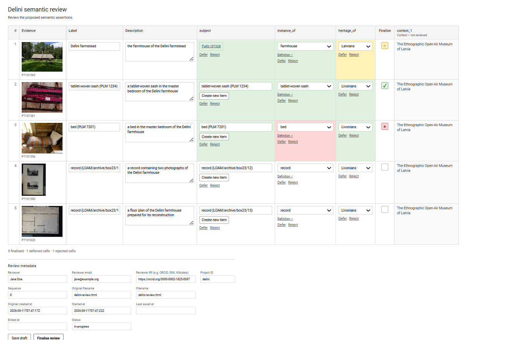

<!-- README.md is generated from README.Rmd. Please edit that file -->

```{r, include = FALSE}
knitr::opts_chunk$set(
  collapse = TRUE,
  comment = "#>",
  fig.path = "man/figures/README-",
  out.width = "100%"
)
```

# betwixt <a href="https://betwixt.dataobservatory.eu/"></a>

<!-- badges: start -->

[](https://lifecycle.r-lib.org/articles/stages.html#experimental) [](https://www.repostatus.org/#wip) [](https://github.com/dataobservatory-eu/betwixt) [](https://dataobservatory.eu/)
[](https://github.com/dataobservatory-eu/betwixt/actions/workflows/R-CMD-check.yaml)
<!-- badges: end -->

**Betwixt** is a lightweight framework for preparing semantic assertions for human review and recording the resulting reviewed state.

Many interoperability, metadata, knowledge graph, and AI-assisted workflows can generate plausible semantic assertions without being able to determine whether those assertions should be accepted. Betwixt provides the intermediate review layer between those candidate assertions and their subsequent use.

Its purpose is **semantic stabilisation, not workflow management**.

## How Betwixt works

Betwixt separates candidate knowledge, human review, and subsequent semantic projection:

```text
candidate assertions
        ↓
candidate dataset
        ↓
bounded review task
        ↓
human review
        ↓
reviewed state
        ↓
semantic projection
        ↓
subsequent processing
and serialisation
```

A candidate dataset contains the assertions proposed for review together with the evidence, descriptive information, semantic definitions, and context needed to evaluate them.

Betwixt renders this dataset as a standalone HTML review that can be opened and completed in an ordinary web browser. The completed review can then be read back into R and projected into tabular or RDF representations.

Candidate preparation and human review have separate provenance. Betwixt therefore records not only the resulting assertions, but also where the candidate dataset and reviewed state came from.

## Installation

You can install the development version from GitHub:

```r
# install.packages("pak")
pak::pak("dataobservatory-eu/betwixt")
```

## Candidate datasets

A Betwixt candidate dataset is an ordinary wide data frame. Reviewable columns can be accompanied by an optional controlled range and an optional semantic definition:

```text
subject, subject_range, subject_definition

instance_of, instance_of_range, instance_of_definition
```

Display-only information uses the `context_*` convention:

```text
context_year, context_unit, context_held_by
```

Context accompanies assertions during review but does not itself become a reviewed assertion.

Candidate datasets can be constructed in R or prepared externally in Excel, LibreOffice, a database, another programming language, or any other system capable of producing tabular data.

## A minimal review

The `delini` dataset provides a small cultural heritage example with evidence, descriptions, semantic assertions, and contextual information.

```r
library(betwixt)

data("delini")
delini
```

A standalone review can be created directly from the candidate dataset:

```r
render_review(
  delini,
  title = "Delini semantic review",
  description = "Review the proposed semantic assertions.",
  reviewer_name = "Jane Doe",
  reviewer_iri = "https://orcid.org/0000-0002-1825-0097",
  project_id = "delini",
  filename_stem = "delini-review",
  path = tempdir() # your working directory
)
```



The resulting [HTML file](https://usebetwixt.com/examples/delini-review.html) contains the candidate assertions and the information required to review them. It does not require an R session, database, or Betwixt installation while the review is being performed.

The reviewer can inspect evidence, edit proposed values, qualify assertions, add comments where enabled, save drafts (see [HTML](https://usebetwixt.com/examples/delini-review_1-draft.html)), and finalise (see [HTML](https://usebetwixt.com/examples/delini-review_1-finalised.html)) the review.

## Reading a completed review

A saved review can be reconstructed in R:

```r
review <- read_review("delini-review_1-finalised.html")
```

The resulting object keeps the candidate and reviewed states separate:

```r
review$candidate
review$reviewed
review$provenance
```

This distinction is important. Human review does not overwrite the candidate evidence from which the reviewed state was derived.

## Review projections

Reviewed knowledge can be projected into wide or long tabular forms:

```r
wide <- project_review_wide(review)
long <- project_review_long(review)
```

The wide projection preserves the tabular structure used during review and represents candidate, reviewed, and status planes.

The wide projection keeps the original tabular structure and adds a `plane` column. Each source row can therefore appear in three aligned states: the original candidate values, the reviewed values, and their review status.

| row_number | plane     | subject         | label            | instance_of | heritage_of |
|-----------:|-----------|-----------------|------------------|-------------|-------------|
| 1          | candidate | fuds:Q7328      | Delini farmstead | farmhouse   | Livonians   |
| 1          | reviewed  | fuds:Q7328      | Delini farmstead | farmhouse   | Livonians   |
| 1          | status    | corroborated    | corroborated     | corroborated| corroborated|
| 5          | candidate | bed (PLM 7201)  | bed (PLM 7201)   | bed         | Livonians   |
| 5          | reviewed  | bed (PLM 7201)  | bed (PLM 7201)   | bed         | Do not know |
| 5          | status    | corroborated    | corroborated     | corroborated| deferred    |

The `candidate` plane preserves the proposed assertions, the `reviewed` plane contains the values after human review, and the `status` plane records the review outcome for each reviewable assertion. Evidence and `context_*` columns remain aligned with the row but are not themselves reviewed.

The long projection represents individual semantic assertions as `subject`, `predicate`, and `value` rows. Review status belongs to the assertion, while `context_*` fields remain inherited row context rather than becoming assertions themselves.

The long projection represents each atomic assertion as a separate `subject`–`predicate`–`value` row. Candidate and reviewed assertions remain separate, while review status is attached to the assertion rather than represented as a third plane.

| assertion_number | row_number | plane     | subject    | predicate    | value            | status       |
|-----------------:|-----------:|-----------|------------|--------------|------------------|--------------|
| 1                | 1          | candidate | fuds:Q7328 | label        | Delini farmstead | corroborated |
| 2                | 1          | candidate | fuds:Q7328 | description  | the farmhouse... | corroborated |
| 3                | 1          | reviewed  | fuds:Q7328 | label        | Delini farmstead | corroborated |
| 4                | 1          | reviewed  | fuds:Q7328 | description  | the farmhouse... | corroborated |
| 5                | 1          | candidate | fuds:Q7328 | instance_of  | farmhouse        | corroborated |
| 6                | 1          | candidate | fuds:Q7328 | heritage_of  | Livonians        | corroborated |
| 7                | 1          | reviewed  | fuds:Q7328 | instance_of  | farmhouse        | corroborated |
| 8                | 1          | reviewed  | fuds:Q7328 | heritage_of  | Livonians        | corroborated |

Unlike the wide projection, the long projection has no separate `status` plane. Each candidate or reviewed assertion carries its review status directly. Row-scoped `context_*` fields are inherited by the assertions generated from that row, while reviewer, data-manager, project, and timestamp columns preserve the provenance needed for interchange and serialisation.

## RDF serialisation

Betwixt can serialise a completed review as RDF (see the full Turtle serialisation [here](https://usebetwixt.com/examples/delini-review_1-finalised.ttl)). For example, a reviewed assertion for which the reviewer deferred judgement is represented as:

```turtle
@prefix btx: <https://usebetwixt.com/ns/> .

<reviewed-1/assertion/12>
    a btx:Assertion ;
    btx:rowNumber 3 ;
    btx:subject "bed (PLM 7201)" ;
    btx:predicate "heritage_of" ;
    btx:value "Do not know" ;
    btx:status btx:Deferred .
```

The Betwixt ontology is deliberately unusual: it is **not a domain ontology** for cultural heritage, archives, music, or any other subject area. It describes the intermediate state of semantic assertions undergoing human review. The `subject`, `predicate`, and `value` above therefore record the reviewed assertion without requiring Betwixt to adopt the ontology of the system from which it came or the system into which it may later be projected.

Candidate and reviewed assertions are kept in separate datasets, linked through PROV-O provenance. This allows Betwixt to preserve what was proposed, what the reviewer decided, and how the reviewed state was derived without turning Betwixt itself into another domain knowledge model.

See the [Betwixt Vocabulary](https://usebetwixt.com//articles/betwixt-vocabulary.html)

vignette for the vocabulary, review-status model, provenance structure, and the distinction between Betwixt's intermediate representation and subsequent semantic projections.

## Design principles

Betwixt is intentionally small. Its main design principles are:

- **Human judgement remains explicit.** Automated and AI-assisted processes may propose assertions without silently promoting them to reviewed knowledge.
- **Candidate and reviewed states remain distinct.** Review creates a new semantic state rather than rewriting its source.
- **Provenance is first-class.** Candidate preparation and human review are separate activities.
- **Context is not an assertion.** Display-only `context_*` information can accompany a review without acquiring review status.
- **The representation is portable.** Candidate datasets are ordinary tabular data and standalone reviews use standard web technologies.
- **Projection is separate from review.** Reviewed assertions can later be transformed for RDF, databases, metadata systems, or other target environments.

Betwixt does not attempt to align ontologies automatically. It records reviewed correspondences and assertions that can warrant subsequent bounded semantic projections.

## Documentation

The package documentation develops the workflow in more detail:

- [Betwixt Implementation](https://usebetwixt.com/articles/scoped-claims.html) introduces semantic stabilisation and the conceptual review model.
- [Review Layouts and Semantic Projections](https://usebetwixt.com/articles/layout.html) explains wide and long representations using the Delini example.
- [Creating Candidate Datasets](https://usebetwixt.com/articles/candidate_dataset.html) constructs candidate data from ordinary source data using a museum example.
- [Working with Externally Created Candidate Datasets](https://usebetwixt.com/articles/imported_datasets.html) demonstrates the portable spreadsheet-to-review workflow.
- [Projecting and Serialising Reviewed Knowledge](https://usebetwixt.com/articles/serialisation.html) covers reconstruction, projection, provenance, and RDF serialisation.

## Citation

If you use Betwixt in research, please cite:

> Antal, D. (2026). *Betwixt*. Reprex.  
> https://doi.org/10.5281/zenodo.22091535

The current citation is also available from R:

```r
citation("betwixt")
```
