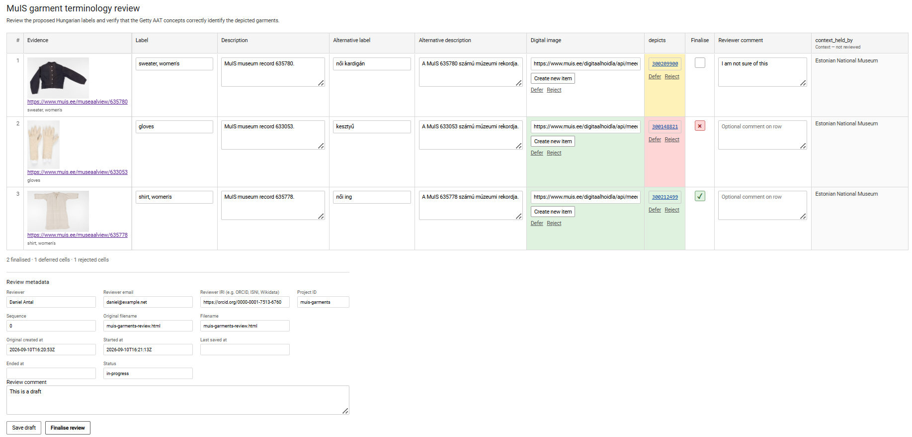
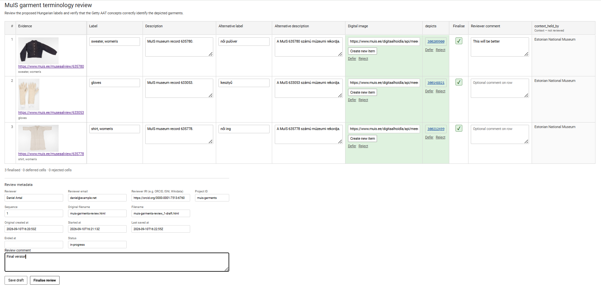

```{r, include = FALSE}
knitr::opts_chunk$set(
  collapse = TRUE,
  comment = "#>"
)
```

# Overview

A Betwixt review begins with a **candidate dataset**. The candidate dataset brings together evidence made available to a reviewer, human-readable descriptions of the objects under review, and candidate semantic assertions that the reviewer is asked to evaluate. It defines the input to review rather than the resulting review state.

```{r setup}
library(betwixt)
library(tibble)
```

This vignette constructs a small candidate dataset from three museum records in MuIS, the Estonian museum information system. The example includes:

- thumbnails presented directly as evidence;
- links to the corresponding museum records;
- primary and alternative descriptive information;
- candidate semantic assertions linked to Getty AAT concepts;
- row-level contextual information; and
- dataset-level provenance describing preparation of the candidate state.

The example uses a wide review representation, in which each row groups the review material for one object and candidate assertions are exposed through columns.

## Source data

We begin with an ordinary tibble. There is nothing Betwixt-specific about this input representation.

```{r}
review_input <- tibble::tribble(
  ~page_id, ~label_en, ~description_en, ~label_hu, ~description_hu,
  ~page_url, ~thumbnail_url,
  ~subject, ~predicate, ~value, ~value_definition,
  "635780",
  "sweater, women's",
  "MuIS museum record 635780.",
  "női kardigán",
  "A MuIS 635780 számú múzeumi rekordja.",
  "https://www.muis.ee/museaalview/635780",
  paste0(
    "https://www.muis.ee/digitaalhoidla/api/meedia/pisipilt?",
    "id=ebc07930-f719-44f2-a108-6698bcecc20b"
  ),
  paste0(
    "https://www.muis.ee/digitaalhoidla/api/meedia/pisipilt?",
    "id=ebc07930-f719-44f2-a108-6698bcecc20b"
  ),
  "depicts",
  "300209900",
  "http://vocab.getty.edu/page/aat/300209900",
  "633053",
  "gloves",
  "MuIS museum record 633053.",
  "kesztyű",
  "A MuIS 633053 számú múzeumi rekordja.",
  "https://www.muis.ee/museaalview/633053",
  paste0(
    "https://www.muis.ee/digitaalhoidla/api/meedia/pisipilt?",
    "id=6440f24f-eaad-4cd4-84d7-1ae7a9d44d5a"
  ),
  paste0(
    "https://www.muis.ee/digitaalhoidla/api/meedia/pisipilt?",
    "id=6440f24f-eaad-4cd4-84d7-1ae7a9d44d5a"
  ),
  "depicts",
  "300148821",
  "http://vocab.getty.edu/page/aat/300148821",
  "635778",
  "shirt, women's",
  "MuIS museum record 635778.",
  "női ing",
  "A MuIS 635778 számú múzeumi rekordja.",
  "https://www.muis.ee/museaalview/635778",
  paste0(
    "https://www.muis.ee/digitaalhoidla/api/meedia/pisipilt?",
    "id=826c402e-c130-4860-b11e-9538bd403ecf"
  ),
  paste0(
    "https://www.muis.ee/digitaalhoidla/api/meedia/pisipilt?",
    "id=826c402e-c130-4860-b11e-9538bd403ecf"
  ),
  "depicts",
  "300212499",
  "http://vocab.getty.edu/page/aat/300212499"
)
```

The input separates evidence, human-readable descriptive information, and values that will become *candidate assertions*. Keeping these roles distinct is important because their presence in the same review representation does not give them the same semantic or review role.

In this particular example, we will change the translation `női kardigán` to `női pulóver`.

## Evidence

Betwixt distinguishes between evidence that is presented directly in the review interface and evidence resources that a reviewer may open.

In this example, the MuIS thumbnail is presented directly:

``` text
evidence_media_url = review_input$thumbnail_url
```

while the museum record itself is retained as an evidence resource:

``` text
evidence_url = review_input$page_url
```

A short human-readable identification of the evidence is supplied separately:

``` text
evidence_text = review_input$label_en
```

This distinction allows a review to present convenient visual evidence while separately retaining links to evidence resources that the reviewer may inspect. Evidence is also distinct from provenance: it supports the assertions under review, whereas provenance records how the candidate and review states were produced.

## Describing the object under review

The primary label and description provide human-readable descriptive information to the reviewer:

``` text
label = review_input$label_en
description = review_input$description_en
```

A review may also contain alternative descriptive information. Here the optional fields provide Hungarian descriptions:

``` text
alternative_label = review_input$label_hu
alternative_description = review_input$description_hu
```

Alternative descriptions are deliberately not restricted to translations. They may contain terminology intended for another user group, a more detailed description, or another useful description of the same object.

## Constructing the candidate dataset

We can now bring these elements together.

```{r}
candidates <- create_candidate_dataset(
  evidence_media_url = review_input$thumbnail_url,
  evidence_url = review_input$page_url,
  evidence_text = review_input$label_en,
  label = review_input$label_en,
  description = review_input$description_en,
  alternative_label = review_input$label_hu,
  alternative_description = review_input$description_hu,
  subject = review_input$subject,
  data_manager_name = "Daniel Antal",
  data_manager_iri = "https://orcid.org/0000-0001-7513-6760",
  data_manager_email = "daniel@example.org",
  project_id = "muis-garments"
)
```

The `subject` column identifies the subject of each candidate assertion. In this example it is the URL of the digital image presented as evidence.

```{r}
candidates
```

The candidate dataset also carries dataset-level provenance. The data manager identifies the person responsible for preparing the candidate state. Betwixt records the generation time and software version automatically.

```{r}
attr(candidates, "provenance")
```

This provenance describes the preparation of the candidate dataset. It is distinct from the provenance of the subsequent review, including the identity of the reviewer and the review lifecycle.

## Adding candidate assertions

Additional reviewable assertions can be added incrementally with `add_candidate_column()`.

Here each image is associated with a proposed concept from the Getty Art & Architecture Thesaurus:

```{r}
candidates <- candidates |>
  add_candidate_column(
    name = "depicts",
    value = review_input$value,
    definition = review_input$value_definition
  )
```

The resulting wide representation contains `subject` and `depicts` as reviewable semantic columns. The accompanying `depicts_definition` records the semantic identity of each proposed value using its Getty AAT URI.

```{r}
candidates
```

The `_definition` column is metadata about the candidate value. It is not itself presented as a separate assertion for review.

The wide tabular structure arranges candidate semantic material for human review without making that table structure the underlying semantic model.

## Adding row context

Some information is useful for interpreting a review row without itself being something that the reviewer is asked to evaluate.

Such information can be represented using `context_*` columns:

```{r}
candidates <- candidates |>
  dplyr::mutate(
    context_held_by = "Estonian National Museum"
  )
```

Here `context_held_by` records the institution holding the objects represented by the MuIS records.

```{r}
candidates
```

Betwixt preserves row context throughout the review and subsequent projections, but does not treat it as a candidate assertion and does not assign it a review status.

## Rendering the review

We can now turn the candidate dataset into a standalone Betwixt review.

```{r eval = FALSE}
render_review(
  candidates,
  cols = c(
    subject = "Digital image",
    depicts = "AAT concept"
  ),
  title = "MuIS garment terminology review",
  description = paste(
    "Review the proposed Hungarian labels and verify that the",
    "Getty AAT concepts correctly identify the depicted garments."
  ),
  row_comment = TRUE,
  reviewer_name = "Daniel Antal",
  reviewer_iri = "https://orcid.org/0000-0001-7513-6760",
  review_comment = TRUE,
  project_id = "muis-garments",
  filename_stem = "muis-garments-review",
  sequence = 0L,
  path = "."
)
```

Candidate provenance and review provenance remain distinct. The data manager recorded in the candidate dataset is responsible for preparing the candidate state. The reviewer recorded by `render_review()` is responsible for evaluating it. The same person may perform both roles, as in this example, without collapsing the distinction between the two activities.

Here `row_comment = TRUE` gives the reviewer an optional comment field for each object. `review_comment = TRUE` adds a separate comment field for observations concerning the review as a whole.

{fig-align="center"}

The resulting review separates several kinds of reviewer intervention:

- editing descriptive information or candidate values;
- qualifying individual candidate assertions;
- finalising individual review rows;
- commenting on an individual row; and
- commenting on the review as a whole.

## Candidate data and review output

The candidate dataset defines the **input to review**. Reviewer decisions and comments are not added to `create_candidate_dataset()` because they belong to the resulting review state rather than to the candidate state.

Instead, the standalone review records those interventions as review proceeds. The initial review generated above is sequence `0`: it contains the candidate state but no reviewer decisions.

[Open the initial candidate review](examples/muis-garments-review.html)

### Saving a review

Once reviewer interventions are recorded, the review has a state distinct from its original candidate input. The first browser save therefore starts review sequence `1`.

Saving a draft preserves the current review state without finalising the review. The standalone HTML retains the original candidate values while also persisting current descriptive and assertion values, assertion qualifications, row finalisation, row comments, review-level comments, reviewer information, candidate provenance, and review lifecycle metadata.

[Open the saved draft](examples/muis-garments-review_1-draft.html)



The reviewer can reopen the saved HTML and continue working with the preserved state.

### Finalising the review

Finalising the review preserves the same information but marks the review activity as completed and records its completion time. It does not by itself promote reviewed assertions into a subsequent stabilised semantic state or apply them to an external knowledge system. A draft and a finalised review from the same review cycle therefore belong to the same sequence.

[Open the finalised review](examples/muis-garments-review_1-finalised.html)



The three files make the review lifecycle directly inspectable:

1.  [candidate review — sequence 0](examples/muis-garments-review.html)
2.  [saved draft — sequence 1](examples/muis-garments-review_1-draft.html)
3.  [finalised review — sequence 1](examples/muis-garments-review_1-finalised.html)

This separation is fundamental to Betwixt. The candidate dataset defines *what is proposed for review* and records the provenance of that candidate state. The saved review preserves that state while recording *what the reviewer did with those proposals* and the provenance of the review activity.

The resulting review artefact therefore preserves a chain from candidate preparation through human review, from which the candidate and reviewed states can subsequently be reconstructed and projected.
