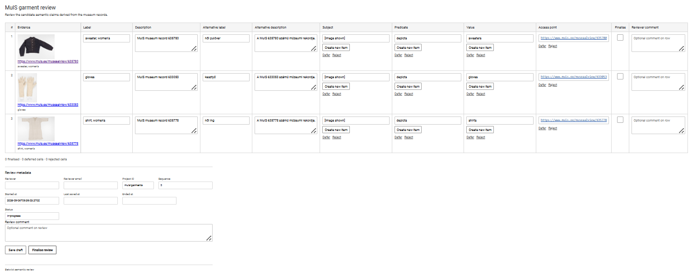
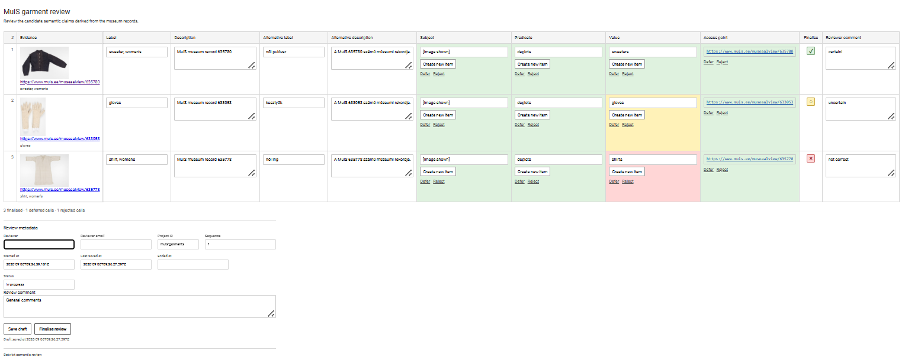
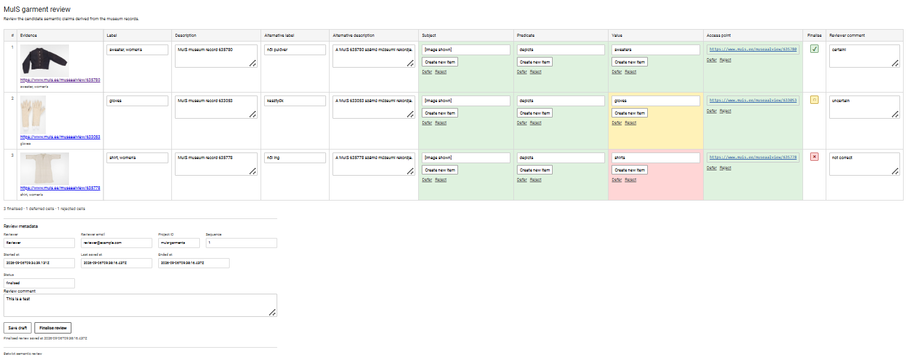

```{r, include = FALSE}
knitr::opts_chunk$set(
  collapse = TRUE,
  comment = "#>"
)
```

# Overview

A Betwixt review begins with a **candidate dataset**. The candidate dataset brings together evidence made available to a reviewer, human-readable descriptions of the objects under review, and candidate semantic assertions that the reviewer is asked to evaluate. It defines the input to review rather than the resulting review state.

```{r setup}
library(betwixt)
```

This vignette constructs a small candidate dataset from three museum records in MuIS, the Estonian museum information system. The example includes:

- a thumbnail presented directly as evidence;
- a link to the corresponding museum record;
- primary and alternative descriptive information;
- several candidate semantic assertions; and
- optional row-level and review-level comments.

The example uses a wide review representation, in which each row groups the review material for one object and candidate assertions are exposed through columns.

## Source data

We begin with an ordinary tibble. There is nothing Betwixt-specific about this input representation.

```{r}
library(betwixt)
library(tibble)

review_input <- tibble::tribble(
  ~page_id, ~title, ~title_hu, ~description_hu,
  ~page_url, ~thumbnail_url,
  ~subject, ~predicate, ~value,
  "635780",
  "sweater, women's",
  "női pulóver",
  "A MuIS 635780 számú múzeumi rekordja.",
  "https://www.muis.ee/museaalview/635780",
  "https://www.muis.ee/digitaalhoidla/api/meedia/pisipilt?id=ebc07930-f719-44f2-a108-6698bcecc20b",
  "[image shown]",
  "depicts",
  "sweaters",
  "633053",
  "gloves",
  "kesztyű",
  "A MuIS 633053 számú múzeumi rekordja.",
  "https://www.muis.ee/museaalview/633053",
  "https://www.muis.ee/digitaalhoidla/api/meedia/pisipilt?id=6440f24f-eaad-4cd4-84d7-1ae7a9d44d5a",
  "[image shown]",
  "depicts",
  "gloves",
  "635778",
  "shirt, women's",
  "női ing",
  "A MuIS 635778 számú múzeumi rekordja.",
  "https://www.muis.ee/museaalview/635778",
  "https://www.muis.ee/digitaalhoidla/api/meedia/pisipilt?id=826c402e-c130-4860-b11e-9538bd403ecf",
  "[image shown]",
  "depicts",
  "shirts"
)
```

The input separates **evidence**, human-readable descriptive information, and values that will become **candidate assertions**. Keeping these roles distinct is important because their presence in the same review representation does not give them the same semantic or review role.

## Evidence

Betwixt distinguishes between evidence that is presented directly in the review interface and evidence resources that a reviewer may open.

In this example, the MuIS thumbnail is presented directly:

```         
evidence_media_url = review_input$thumbnail_url
```

while the museum record itself is an evidence resource:

```         
evidence_url = review_input$page_url
```

A short human-readable identification of the evidence is supplied separately:

```         
evidence_text = review_input$title
```

This distinction allows a review to present convenient visual evidence while separately retaining links to evidence resources that the reviewer may inspect. These roles are distinct from review provenance.

## Describing the object under review

The primary label and description provide human-readable descriptive information to the reviewer. They belong to the review representation but are distinct from the candidate semantic assertions:

```         
label = review_input$title

description = paste(
  "MuIS museum record",
  review_input$page_id
)
```

A review may also contain alternative descriptive information. Here we use the optional fields to provide Hungarian descriptions:

```         
alternative_label = review_input$title_hu
alternative_description = review_input$description_hu
```

Alternative descriptions are deliberately not restricted to translations. They may also contain terminology intended for another user group, a more detailed description, or another useful description of the same object.

## Constructing the candidate dataset

We can now bring these elements together.

```{r}
candidates <- create_candidate_dataset(
  evidence_media_url = review_input$thumbnail_url,
  evidence_url = review_input$page_url,
  evidence_text = review_input$title,
  label = review_input$title,
  description = paste(
    "MuIS museum record",
    review_input$page_id
  ),
  alternative_label = review_input$title_hu,
  alternative_description = review_input$description_hu,
  subject = review_input$subject
)
```

The `subject` identifies the subject of the candidate assertions and is represented as the first candidate column, `col_1`. In this example, `[image shown]` indicates that the proposed assertions concern the object depicted by the evidence presented to the reviewer.

```{r}
candidates
```

At this stage we have a valid candidate dataset, but have not yet added the other assertions that we want the reviewer to evaluate.

## Adding candidate columns

Additional candidate columns can be added incrementally with `add_candidate_column()`.

```{r}
candidates <- candidates |>
  add_candidate_column(
    value = review_input$predicate, 
    name = "predicate",
  ) |>
  add_candidate_column(
    value = review_input$value, 
    name = "value"
  ) |>
  add_candidate_column(
    value = review_input$page_url, 
    name = "resource"
  )
```

The resulting wide projection contains the subject followed by three additional candidate columns. These columns arrange candidate semantic material for review without making the wide tabular structure itself the underlying semantic model.

```{r}
candidates
```

The generic names `col_1`, `col_2`, and so forth belong to the intermediate review representation rather than to the semantics of the assertions themselves. Presentation labels can be assigned when the review is rendered without changing the underlying candidate assertions.

## Rendering the review

We can now turn the candidate dataset into a standalone Betwixt review.

```{r eval = FALSE}
render_review(
  candidates,
  cols = c(
    col_1 = "Subject",
    col_2 = "Predicate",
    col_3 = "Value",
    col_4 = "Access point"
  ),
  title = "MuIS garment review",
  description = paste(
    "Review the candidate semantic assertions derived from",
    "the museum records."
  ),
  row_comment = TRUE,
  review_comment = TRUE,
  project_id = "muis-garments",
  filename_stem = "muis-garments-review",
  sequence = 0L,
  path = "."
)
```

Here `row_comment = TRUE` gives the reviewer an optional comment field for each object. `review_comment = TRUE` adds a separate comment field for observations concerning the review as a whole.

{fig-align="center"}

The resulting review therefore separates several kinds of reviewer intervention:

- editing descriptive information or candidate values;
- qualifying individual candidate assertions;
- finalising individual review rows;
- commenting on an individual row; and
- commenting on the review as a whole.

## Candidate data and review output

The candidate dataset defines the **input to review**. Reviewer decisions and comments are not added to `create_candidate_dataset()` because they belong to the resulting review state rather than to the candidate state.

Instead, the standalone review records those interventions as review proceeds. The initial review generated above is sequence `0`: it contains the candidate state but no reviewer decisions.

[Open the initial candidate review](examples/muis-garments-review.html)

### Saving a review

Once reviewer interventions are recorded, the review has a state distinct from its original candidate input. The first browser save therefore starts review sequence `1`.

Saving a draft preserves the current review state without finalising the review. The standalone HTML retains the original candidate values while also persisting current descriptive and assertion values, assertion qualifications, row finalisation, row comments, review-level comments, reviewer information, and lifecycle metadata.

[Open the saved draft](examples/muis-garments-review_1-draft.html)

{fig-align="center"}

The reviewer can reopen the saved HTML and continue working with the preserved state.

### Finalising the review

Finalising the review preserves the same information but marks the review activity as completed and records its completion time. It does not by itself promote reviewed assertions into a subsequent stabilised semantic state or apply them to an external knowledge system. A draft and a finalised review from the same review cycle therefore belong to the same sequence.

[Open the finalised review](examples/muis-garments-review_1-finalised.html)

{fig-align="center"}

The three files make the review lifecycle directly inspectable:

1.  [candidate review — sequence 0](examples/muis-garments-review.html)
2.  [saved draft — sequence 1](examples/muis-garments-review_1-draft.html)
3.  [finalised review — sequence 1](examples/muis-garments-review_1-finalised.html)

This separation is fundamental to Betwixt. The candidate dataset defines **what is proposed for review**. The saved review preserves that candidate state while recording **what the reviewer did with those proposals**. It is therefore not merely a visual rendering of the original candidate data, but a persistent review artefact from which the candidate and reviewed states can be distinguished and reconstructed.
