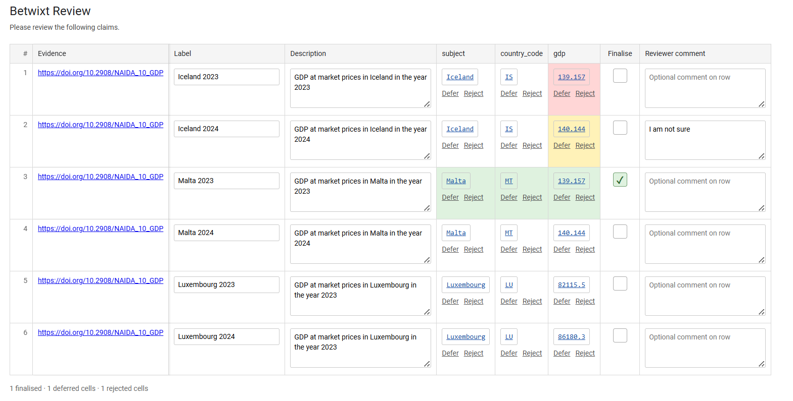

## Candidate datasets outside Betwixt

Betwixt does not require candidate datasets to be created programmatically. A candidate dataset is a tabular data structure that follows the Betwixt candidate-data contract. It may therefore be prepared in Excel or LibreOffice, generated by another statistical application, exported from a database, or produced by a workflow written in another programming language.

This vignette demonstrates this workflow using a small statistical dataset containing GDP observations for Iceland and Malta for two reference years. The example is intentionally small enough to inspect and edit manually.

```{r}
library(betwixt)
small_countries_dataset
```

The same dataset can be downloaded from [usebetwixt.com/examples](https://usebetwixt.com/examples/) and opened in a spreadsheet application.

## Understanding the example

Each row represents an observation about a country in a particular year.

The `subject` column contains the human-readable country name, while `subject_definition` provides a resolvable GeoNames identifier for that country. The `country_code` column provides its ISO 3166-1 alpha-2 code.

The `gdp` column contains the statistical value. Its `gdp_definition` identifies the Eurostat national-accounts concept `B1GQ`, gross domestic product at market prices. The `evidence_url` points to the DOI of the Eurostat dataset from which the observations were obtained.

Columns prefixed with `context_`, such as `context_year` and `context_unit`, provide row-level context needed to interpret an observation. They are preserved and displayed during review but are not themselves candidate assertions and do not receive a review status.

This separation is important. A value such as a country name or GDP figure may be easy for a person to recognise, while its definition, evidence, and observational context make its intended interpretation explicit.

## Extend the dataset in a spreadsheet

Download the example dataset and open it in Excel, LibreOffice, or another spreadsheet application.

Suppose we use the same Eurostat source to add Luxembourg for the same two reference years. We add the country name, its GeoNames identifier, country code, and two GDP observations while retaining the existing GDP definition, unit, and evidence source.

After saving the edited spreadsheet, it can be read back using the ordinary tool appropriate for its file format. For example:

```{r eval=FALSE}
candidates <- readxl::read_excel("small_countries_dataset.xlsx")
```

You can download the CSV serialisation of the dataset at <http://usebetwixt.com/examples/small_countries_dataset.xlsx>.

For a CSV file, the equivalent operation could use base R:

```{r eval=FALSE}
candidates <- utils::read.csv("small_countries_dataset.csv")
```

You can download the Excel version of the dataset at <http://usebetwixt.com/examples/small_countries_dataset.csv>.

Betwixt does not provide a special import function. The same principle applies outside R: a Python workflow might use pandas, while another application may use its own standard tabular-data tools.

For the remainder of this vignette, we reproduce the result of the spreadsheet edit directly so that the example is executable.

```{r extendcountries}
candidates <- rbind(
  small_countries_dataset,
  data.frame(
    row_number = 5:6,
    evidence_url = rep(
      "https://doi.org/10.2908/NAIDA_10_GDP", 2
    ),
    label = c("Luxembourg 2023", "Luxembourg 2024"),
    description = c(
      "GDP at market prices in Luxembourg in the year 2023",
      "GDP at market prices in Luxembourg in the year 2024"
    ),
    subject = rep("Luxembourg", 2),
    subject_definition = rep(
      "https://www.geonames.org/countries/LU/", 2
    ),
    country_code = rep("LU", 2),
    country_code_definition =
      "https://www.iso.org/iso-3166-country-codes.html",
    gdp = c(82115.5, 86180.3),
    gdp_definition =
      "http://dd.eionet.europa.eu/vocabulary/eurostat/na_item/B1GQ",
    context_year = c(2023L, 2024L),
    context_unit = rep("CP_MEUR", 2)
  )
)

candidates
```

*The construction above is included only to make the vignette reproducible. In the workflow being demonstrated, these two rows were added in the spreadsheet rather than programmatically in R.*

## Validate the edited dataset

Reading a file successfully does not guarantee that it conforms to the Betwixt candidate-data contract. Externally created or edited data can therefore be checked before review.

```{r}
validate_candidate_dataset(candidates)
```

Successful validation returns the dataset invisibly. If the structure is invalid, an error identifies the first validation failure. Otherwise, the dataset is ready for review.

If you want to try error messages, for example, try deleting the `subject` column in the spreadsheet or replacing one of the values in `evidence_url` with `not-a-url`, read the file again, and rerun `validate_candidate_dataset()`.

```{r, eval=FALSE}
validate_candidate_dataset(candidates[, names(candidates)[-4]])
```

## Render the review

Once the edited dataset passes validation, it enters exactly the same review workflow as a candidate dataset constructed programmatically.

```{r renderhtml}
render_review(
  candidates,
  row_comment = TRUE, # allow reviewer comment on row
  review_comment = TRUE, # allow reviewer general comments on task
  filename_stem = "small_countries_dataset_extended",
  reviewer_name = "Jane Doe",
  reviewer_iri = "https://orcid.org/0000-0002-1825-0097",
  project_id = "GDP_review",
  path = tempdir() # replace it with your working directory path
)
```

You can download a copy of the extended dataset in review-ready HTML at <https://usebetwixt.com/examples/small_countries_dataset_extended.html>.

The rendered review is written to a temporary directory so that building the vignette does not create an HTML file in the package source tree.

[{fig-align="center"}](https://usebetwixt.com/examples/small_countries_dataset_extended_1-draft.html)

You can also download a finalised version of the review at <https://usebetwixt.com/examples/small_countries_dataset_extended_1-finalised.html>.

The review interface does not depend on whether the candidate dataset originated in R, Excel, Python, a database, or another system. The candidate-data contract provides the boundary between data preparation and human review.

## Starting from an empty template

When preparing a new dataset manually, Betwixt can generate an empty table with a conforming column structure.

```{r}
template <- create_candidate_template(
  columns = c("country_code", "gdp"),
  context = c("year", "unit")
)

template
```

The template can then be written using an ordinary file-format tool:

```{r eval=FALSE}
utils::write.csv(
  template,
  "candidate_template.csv",
  row.names = FALSE
)
```

The resulting file can be populated in a spreadsheet application and subsequently read and validated in exactly the same way as the example above.

You can download the template from <https://usebetwixt.com/examples/candidate_template.csv>.

## A portable data contract

The externally authored workflow can therefore be summarised as:

**download or create → edit → read → validate → review**

Betwixt is responsible for defining and validating the candidate-data structure and for turning conforming candidate data into a human review task. File formats and file input/output remain the responsibility of the surrounding data ecosystem.

This allows the same candidate-data contract to be used across spreadsheet, R, Python, database, and other workflows without requiring a Betwixt-specific interchange format.
