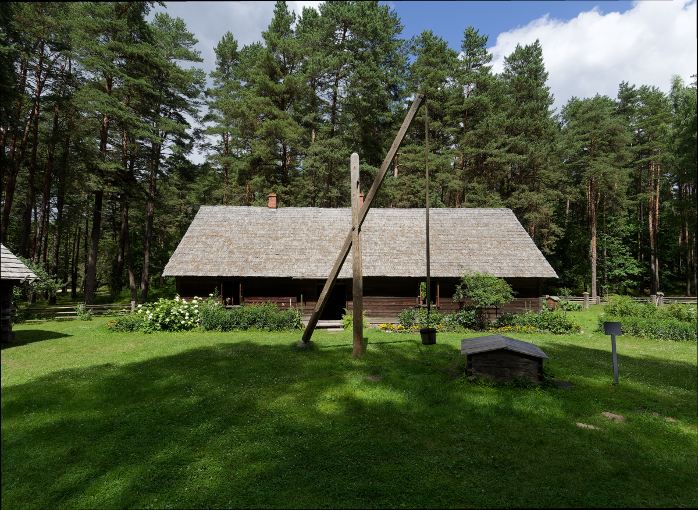
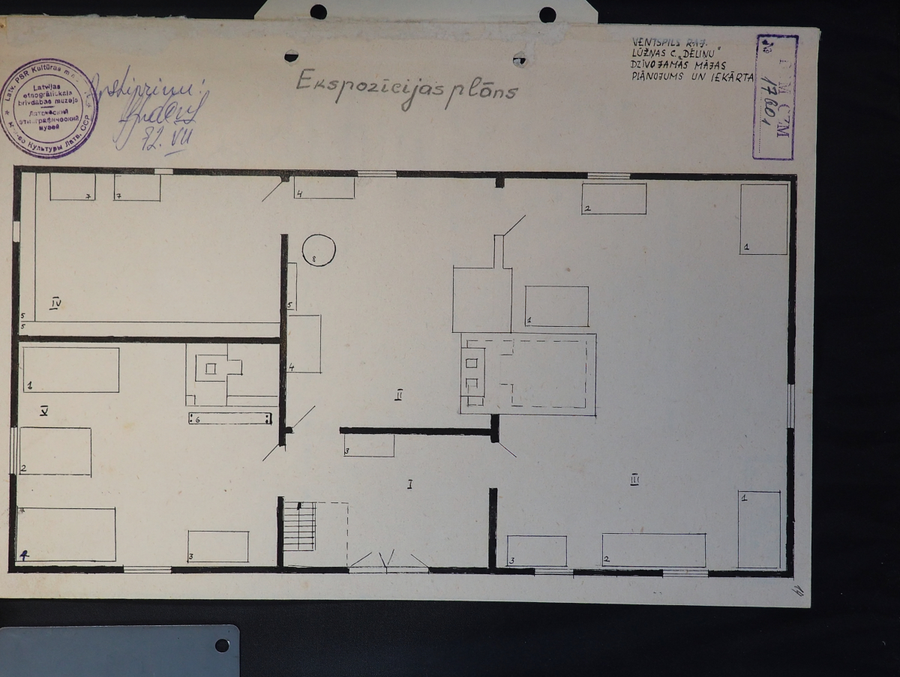

```{r, include = FALSE}
knitr::opts_chunk$set(
  collapse = TRUE,
  comment = "#>"
)
```

```{r setup}
library(betwixt)
```

## Review as a human-readable projection

Betwixt review interfaces provide human-readable projections of semantic
assertions together with the evidence and contextual information needed to
review them.

A review interface distinguishes four blocks.

| Block | Role in the interface | Review semantics |
|---|---|---|
| Evidence | What the curator inspects | Display |
| Descriptive metadata | Human-readable description or identification | Fill in or edit |
| Semantic assertion | Knowledge about the thing | Review |
| Context | Information helping the curator decide | Display |

These blocks have deliberately different semantics.

Evidence and contextual information support a review but are not
themselves reviewed by the interface.

Descriptive metadata provide human-readable descriptions or identifiers
for a resource. They may be added or edited, but are not treated as
assertions requiring corroboration, deferral, or rejection.

Semantic assertions are the objects of review. They may be corroborated,
modified, deferred, or rejected.

Not every review interface needs to contain all four blocks. Evidence,
descriptive metadata, semantic assertions, and contextual information
are independently optional according to the purpose of the review.

The renderer does not infer these roles from column names. The caller
specifies which columns are projected into the corresponding interface
blocks.

## Delini Farmstead reference example

The examples in this vignette use a small review task based on the
Delini Farmstead at the Ethnographic Open-Air Museum of Latvia. The
evidence combines three photographs of the farmhouse and objects in
its interior with two documentary records. This provides a compact example containing different kinds of evidence while
remaining small enough for the complete review task to be inspected manually.

The package contains two datasets for this example. `delini_review`
contains the material available for the review, including media
references, multilingual descriptive metadata, semantic values, and
contextual information. `delini_range` contains proposed values and
controlled-vocabulary references that can be offered by the review
interface.

The datasets themselves do not determine how their columns are presented
to the reviewer. That is a property of the review projection. The same
rectangular data may therefore support different review interfaces
without changing the underlying data.

```{r delini-evidence-table, echo=FALSE, results='asis'}
delini_evidence <- data.frame(
  evidence = c(
    '',
    '',
    '',
    '',
    ''
  ),
  type = c(
    "Artefact photograph",
    "Artefact photograph",
    "Artefact photograph",
    "Documentary record",
    "Documentary record"
  ),
  content = c(
    "Delini farmhouse",
    "Bed in the master bedroom",
    "Tablet-woven sash in the master bedroom",
    "Floor plan of the farmhouse",
    "Page from the reconstruction documentation"
  )
)

knitr::kable(
  delini_evidence,
  col.names = c("Evidence", "Type", "Content"),
  align = c("c", "l", "l"),
  escape = FALSE
)
```

The first three evidence objects are photographs of material features
of the Delini Farmstead: the farmhouse itself, a bed in the master
bedroom, and a tablet-woven sash found in the same room. The remaining
two are documentary records: a floor plan of the farmhouse and a page
from the reconstruction documentation. The distinction is useful for
the review example because evidence about a heritage object need not
itself be a photograph of that object.

In this review projection, the media file and optional source URL form
the evidence block. English and Hungarian labels and descriptions,
together with the inventory number, form the descriptive block.
`instance_of` is exposed as a semantic assertion. `evidence_type` and
`held_by` provide contextual information.

This is a choice made for this review task. It does not assign universal
semantic roles to columns named `inventory_number`, `evidence_type`, or
`held_by`.

## Descriptive metadata

Descriptive metadata may include labels and descriptions supplied
without a language designation:

```text
label
description
```

or as language-tagged columns:

```text
label_en
description_en
label_hu
description_hu
```

Language suffixes provide a tabular representation for language-tagged
descriptive metadata. For example,

```text
label_en = "Udmurt woman"
label_hu = "Udmurt nő"
```

may subsequently be serialised as language-tagged RDF literals without
requiring the review interface itself to represent these descriptions
as elementary RDF statements.

Language-specific labels and descriptions are optional and need not
occur in complete pairs. A resource may, for example, have `label_en`,
`description_en`, and `label_hu` without having `description_hu`.

Descriptive metadata are not restricted to labels and descriptions. An
identifier such as an inventory number may also be placed in the
descriptive block when the purpose of the review is to display or edit
that identifier rather than to review it as a semantic assertion.

An inventory number, such as the visible `BDMZ pn 8246` on the
tablet-woven sash, may serve as descriptive metadata in the same sense as a
label or description. In structured data it may, for example, serve as a
foreign key to the museum's inventory system. Its role in this review
is to identify the object and help the reviewer establish which resource
is being considered. It is therefore displayed or, where necessary,
corrected as descriptive metadata rather than treated as an explicit
semantic assertion requiring corroboration, deferral, or rejection.

The columns belonging to the descriptive block are specified explicitly
when the review is rendered. Their role is not inferred from their
names.

## Evidence

Evidence is material presented to the reviewer in support of a review
decision.

Betwixt distinguishes two optional evidence inputs:

```text
evidence_media_file
evidence_url
```

`evidence_media_file` identifies a column containing a media resource
to be presented in the review interface. A media resource is not
necessarily an image. Depending on the review task and renderer support,
it may be an image, audio recording, video recording, document, or
another media object.

`evidence_url` identifies a column containing an optional source URL
that the reviewer may follow to inspect the evidence or its source in
another interface.

Evidence is displayed to support review. Its presence does not by itself
make the evidence resource a reviewed semantic assertion.

## Semantic assertions

The elementary semantic assertion represented by Betwixt has the form

```text
subject — predicate — value
```

For example:

```text
image_001 — depicts — person
image_001 — heritage_of — Udmurts
image_001 — held_by — Estonian National Museum
```

The review projection determines which parts of the available assertion
structure are exposed to the reviewer.

The `assertions` argument identifies the columns presented as the
reviewable assertion block. It therefore describes the review
projection; it does not redefine the underlying semantic model.

## Long review layout

A long review exposes assertion components in columns. A complete
elementary assertion may be projected as:

```text
subject     predicate       value
image_001   depicts         person
image_001   heritage_of     Udmurts
image_001   held_by         ERM
image_002   depicts         building
```

For this projection the renderer is instructed with:

```text
assertions = c("subject", "predicate", "value")
```

The renderer does not need to infer these columns from their names.

A long review does not have to expose all three components. If the
resource represented by the evidence is the subject of the review,
the subject may be implicit:

```text
Evidence        Predicate       Value
[media file]    instance of     farmhouse
[media file]    depicts         sash
```

Such a projection can use:

```text
assertions = c("predicate", "value")
```

The underlying semantic assertion still has a subject. It is not repeated as a
separate review column because the review task already establishes the resource
to which the predicate and value apply.

A long review may also expose more than one candidate value:

```text
Predicate       Value 1         Value 2
creator         Smith           Schmidt
date            1923            1924
```

For example:

```r
assertions = c("predicate", "value1", "value2")
```

`value1` and `value2` are alternative values exposed by the review
projection. Their presence does not change the elementary semantic
model into a four-component assertion.

Evidence, descriptive metadata, and context may be displayed alongside
any of these projections.

## Wide review layout

The wide review layout projects predicates into columns. Each row represents a resource under review, while each reviewable column
contains values of the predicate represented by that column.

For example:

```text
depicts       heritage_of
person        Udmurts
building      Livonians
```

A corresponding projection may specify:

```r
assertions = c("depicts", "heritage_of")
```

Here `depicts` and `heritage_of` are not arbitrary data columns inferred
by the renderer. The caller has explicitly selected them as the
reviewable assertion columns.

Conceptually,

```text
image_001 × depicts → person
```

represents the same elementary assertion as:

```text
image_001 — depicts — person
```

The predicate is explicit in a long projection and encoded by the
column in a wide projection.

The wide layout is particularly useful when a curator reviews the same
set of properties for many comparable resources or observations.

For the Delini example, a wide review may be rendered conceptually as:

```{r rendering, eval=FALSE}
betwixt_render(
  claim = delini_review,
  range = delini_range,
  evidence_media_file = "thumbnail_url",
  evidence_url = "evidence_url",
  descriptive = c(
    "label_en",
    "description_en",
    "label_hu",
    "description_hu",
    "inventory_number"
  ),
  assertions = "instance_of",
  context = c(
    "evidence_type",
    "held_by"
  ),
  title = "Delini Farmstead Review",
  description = paste(
    "Review the proposed classification of each item.",
    "Use the evidence and contextual information to assess the proposed",
    "instance-of value, and correct the English and Hungarian descriptive",
    "metadata where necessary."
  ),
  betwixt_id = "delini-wide",
  template = "wide_review",
  con = "delini_wide.html"
)
```

This call explicitly defines the human-readable projection. It does not
change the semantics of `delini_review`.

## Row numbers

Tabular reviews display a sequential row number generated by the
renderer.

```text
#   Evidence        Description        Assertion       Context
1   ...             ...                ...             ...
2   ...             ...                ...             ...
3   ...             ...                ...             ...
```

The row number provides a natural reference for reviewers navigating a
table and a local identifier for controls within the rendered review.

It is part of the review interface rather than the candidate dataset.
The source data therefore do not need a synthetic evidence or row
identifier solely for rendering purposes.

## Long and wide are review projections

Long and wide layouts do not define different kinds of semantic
knowledge. They are different tabular projections of the same
underlying assertions.

A long projection may make the elementary assertion explicit:

```text
subject     predicate       value
image_001   depicts         person
```

A wide projection may encode the predicate in a column:

```text
depicts
person
```

A hybrid long projection may leave the subject implicit because the
evidence establishes the resource under review:

```text
Evidence        Predicate       Value
[media file]    depicts         person
```

These are differences in what the reviewer sees, not differences in the
underlying semantic model.

The choice of projection is therefore primarily a property of the review
task.

Use a complete long projection when the subject, predicate, and value
themselves need to be exposed to the reviewer.

Use a reduced long projection when part of the assertion is established
by the review context and need not be repeated.

Use a wide projection when predicates are established by the review
task and the curator primarily reviews their values.

## Multi-valued assertions

A subject may have more than one value for the same predicate:

```text
image_001 — depicts — person
image_001 — depicts — building
```

A long projection may represent these as multiple rows or expose
multiple candidate-value columns when appropriate to the review task.

A wide review interface may present the corresponding cell as a
multi-value review control.

Neither projection should therefore be interpreted as imposing a
functional relationship between a predicate and a single value.

## Review ranges

Review ranges provide proposed or permitted alternatives for reviewable
assertion components.

In a long projection, ranges may apply to exposed assertion components
such as `subject`, `predicate`, or `value`.

In a wide projection, a value range may be associated with a particular
assertion column. For example, a range whose `field` is `instance_of`
applies to the `instance_of` review column rather than to every value
displayed in the table.

Ranges belong to reviewable assertions. Descriptive metadata, evidence,
and contextual information do not acquire review semantics merely
because they appear in the same rectangular input data.

## Review outcomes and domain values

Review controls must distinguish domain values from review outcomes.

For example, a review of `depicts` might offer:

```text
person
building
landscape
Other proposal...
No identifiable subject depicted
```

The final option is not a value of `depicts`. It is a review action
indicating that the proposed assertions should not be accepted.

The review interface must therefore not serialise such interface
actions as domain assertions such as:

```text
image_001 — depicts — "nothing meaningful"
```

Review state and domain knowledge remain distinct.

## A common rendering model

Betwixt separates the semantic material supplied for review from its
human-readable projection.

The rendering interface specifies:

```text
evidence_media_file
evidence_url
descriptive
assertions
context
template
```

The first five identify the information exposed in the corresponding parts of
the review interface. `template` determines how that material
is laid out.

Long and wide layouts therefore remain alternative projections rather
than alternative semantic models. Multilingual description is not a
separate layout. Neither is image review, audio review, or documentary
review. These are characteristics of the material presented through
the common rendering interface.

This allows the same renderer to support different review tasks without
inferring semantic roles from arbitrary column names and without
introducing a separate renderer for every combination of evidence type,
language, semantic property, or review layout.
